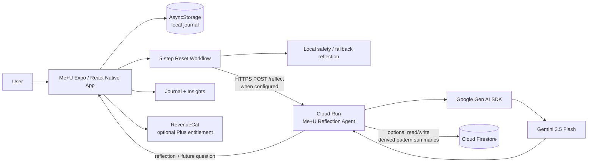

# Me+U Architecture

## Request path

1. The user completes a structured reset in the mobile app.
2. The full journal entry is saved locally with AsyncStorage.
3. If no cloud endpoint is configured, the app returns a deterministic local reflection and remains fully usable offline.
4. If the Cloud Run endpoint is configured, the app sends the completed structured reset plus a random device memory ID to `/reflect`.
5. The Cloud Run service applies a deterministic direct-harm-language guard before model invocation.
6. The service optionally reads up to five recent derived pattern summaries from Firestore.
7. Google Gen AI SDK sends the structured reset and tentative memory context to Gemini 3.5 Flash.
8. Gemini returns a concise reflection, neutral pattern summary, and future question.
9. The server optionally stores only the derived pattern, mood, chosen response, and written next move. It does not intentionally persist the raw vent text.
10. The mobile app displays the reflection while preserving the full reset locally in Journal and Insights.

## Trust boundaries

- Gemini API credentials remain server-side in Cloud Run/Secret Manager.
- Expo public environment variables contain only the public Cloud Run endpoint and optional RevenueCat public SDK key.
- Firestore memory uses a random device ID rather than a name or email.
- The hackathon service is deliberately minimal; production requires authentication, rate limiting, retention/deletion controls, explicit cloud-memory consent, and abuse monitoring.
